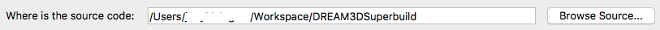

# Making an SDK (OS X) #

<a name="prerequisites">

## Prerequisites ##

</a>

These prerequisites need to be completed before making a DREAM.3D SDK.

If you have already fulfilled all of these prerequisites, skip to the [Procedure](#procedure) section.

<a name="compiler_suite">

### Install a Compiler Suite ###

</a>

A compatible compiler needs to be installed on your system to be able to build DREAM.3D.

For more information, please visit [Installing a Compiler Suite](http://www.dream3d.io/6_Developer/CompilerSuite/index.html).

| Compiler Version | OS X Version |
| ---------------- | ------------ |
| Xcode 11 | OS X 10.15 |

## Procedure ##

#### Basic Setup ####

**1: Create a folder called DREAM3D_SDK in the /Users/Shared folder**

**2: Download and install CMake from https://cmake.org/download:**

Scroll down the page until you see the **Latest Release** section.  The latest release may be a higher version than 3.7.2.

Press the download link to download the tar.gz file of the latest release of CMake.  Again, the latest release may be a higher version than 3.8.2 but that is ok.

Click on the tar.gz file that you just downloaded to expand it into a folder.

Move the newly expanded folder into the **DREAM3D_SDK** folder that we created earlier.

**3: Download and install the "Ninja" build system from https://github.com/ninja-build/ninja/releases:**

Press the download link to download the **ninja-mac.zip** file.
Click on the zip file that you just downloaded to expand it into the ninja executable.

Place the executable in **/usr/local/bin**.

**4: Download and install Doxygen from http://www.stack.nl/~dimitri/doxygen/download.html:**

Scroll down until you see the **Sources and Binaries** section.  Press the http download link to download the .dmg file of the latest release of Doxygen.

Open the .dmg file and copy the app into **/Applications**. You may need admin privileges on your computer to complete this step.

**5: Download and install Xcode from the App Store located at /Applications/App Store.app**
After Xcode has been downloaded and installed, open it so that *Xcode Command Line Tools* will be installed.  **You CANNOT continue with setup until *Xcode Command Line Tools* has been installed!**

#### Clone Repository ####

Create a folder called **Workspace** in your home directory, and then use git to clone the DREAM.3D Superbuild repository at https://github.com/bluequartzsoftware/DREAM3DSuperbuild to the **Workspace** folder that you just created.

    git clone https://github.com/bluequartzsoftware/DREAM3DSuperbuild.git
    

#### Instructions ####

1. Open CMake and set the **Where is the source code** path to */Users/[YOUR-HOME-FOLDER]/Workspace/DREAM3DSuperbuild*.

2. Set the **Where to build the binaries** path to */Users/[YOUR-HOME-FOLDER]/Workspace/Builds/DREAM3DSuperbuild-Build/Debug*.

3. We are going to create a CMake variable.  Press the **Add Entry** button.

4. Set the **Name** to *DREAM3D_SDK*.  Set the **Type** to *PATH* and set the **Value** to the location of the DREAM3D_SDK folder that we created earlier (*/Users/Shared/DREAM3D_SDK*)

5. Repeat steps 3 & 4, except set **Name** to *CMAKE_MAKE_PROGRAM*, **Type** to *FILEPATH*, and **Value** to the path to our ninja executable that we added earlier (*/usr/local/bin/ninja*).

6. You should now have two variables, DREAM3D_SDK and CMAKE_MAKE_PROGRAM.

7. Press the **Configure** button in CMake. At this point, Qt 5 will be automatically downloaded and installed.  Since the Qt download is over 1 GB in size, this may take some time so please be patient.

Sometimes there is a pause between the download completing and the installer popping up, so just wait a minute or so for the installer to appear.

8. When the installer is finished, make sure that **CMAKE_BUILD_TYPE** is set to *Debug*.

9. Press the **Configure** button in CMake again.

10. Press the **Generate** button in CMake to generate the build files.

11. Repeat steps 1-10, except use path */Users/[YOUR-HOME-FOLDER]/Workspace/Builds/DREAM3DSuperbuild-Build/Release* for step 2 and set **CMAKE_BUILD_TYPE** to *Release* in step 8.

    *Note*: Although you still need to press **Configure** in step 7, Qt will not download or install again because it was already downloaded and installed the first time through.

12. Open Terminal, and navigate to **/Users/*[YOUR-HOME-FOLDER]*/Workspace/Builds/DREAM3DSuperbuild-Build/Debug**.

13. Execute the command:

    `ninja`

    It will build the Debug version of the SDK.  Please be patient, it takes a while to build all the dependent libraries.

14. When the Debug version of the SDK is done building, navigate to **/Users/*[YOUR-HOME-FOLDER]*/Workspace/Builds/DREAM3DSuperbuild-Build/Release**.

15. Execute the command:

    `ninja`

    It will build the Release version of the SDK.  Please be patient, it takes a while to build all the dependent libraries.

16. Navigate to **/Users/Shared/DREAM3D_SDK**. This is your newly created SDK and can be used to compile DREAM.3D.

## Building DREAM.3D ##

Now that you have all of the dependent libraries built you are now ready to compile DREAM.3D. For the examples below we are going to assume the following folder structure:

* DREAM3D_SDK is located at /Users/Shared/DREAM3D_SDK
* DREAM3D_WORKSPACE is located at /Users/[USERNAME\]/Workspace

There are 6 basic git repositories that need to be cloned:

    git clone https://www.github.com/bluequartzsoftware/CMP.git
    git clone https://www.github.com/bluequartzsoftware/H5Support.git
    git clone https://www.github.com/bluequartzsoftware/EbsdLib.git
    git clone https://www.github.com/bluequartzsoftware/SIMPL.git
    git clone https://www.github.com/bluequartzsoftware/SIMPLView.git
    git clone https://www.github.com/bluequartzsoftware/DREAM3D.git

In addition there are a few extra repositories that are always built as part of the standard DREAM3D build:

    git clone https://www.github.com/bluequartzsoftware/ITKImageProcessing DREAM3D_Plugins/ITKImageProcessing
    git clone https://www.github.com/bluequartzsoftware/SimulationIO DREAM3D_Plugins/SimulationIO
    git clone https://www.github.com/dream3d/DREAM3DReview DREAM3D_Plugins/DREAM3DReview
    git clone https://www.github.com/dream3d/UCSBUtilities DREAM3D_Plugins/UCSBUtilities

After you have finished cloning the sources your *Workspace* folder should look like this:

    Workspace/CMP
    Workspace/EbsdLib
    Workspace/H5Support
    Workspace/DREAM3D
    Workspace/DREAM3D_Plugins/ITKImageProcessing
    Workspace/DREAM3D_Plugins/SimulationIO
    Workspace/DREAM3D_Plugins/DREAM3DReview
    Workspace/DREAM3D_Plugins/UCSBUtilities
    Workspace/SIMPL
    Workspace/SIMPLView

Use CMake-GUI to configure the DREAM.3D project. Before clicking the configure button it should look like the following (NOTE: Your username will be different than mine)