# Making an SDK (Windows) #

<a name="prerequisites">

## Prerequisites ##

</a>

These prerequisites need to be completed before making a DREAM.3D SDK.

If you have already fulfilled all of these prerequisites, skip to the [Procedure](#procedure) section.

<a name="compiler_suite">

### Install a Compiler Suite ###

</a>

A compatible compiler needs to be installed on your system to be able to build DREAM.3D.

This tutorial uses Visual Studio to build an SDK from DREAM3DSuperbuild.  Ensure you have the proper Version of Visual Studio installed.  Versions 2015 and 2017 are supported in this release and should be usable.  Both the **Professional** and **Community** versions will work.

For more information, please visit [Installing a Compiler Suite](http://dream3d.bluequartz.net/binaries/Help/DREAM3D/compiler_suite.html).

### Install Git ###

Git needs to be installed on your system to be able to clone repositories from Github.

To install Git, please visit the [Git website](https://git-scm.com/downloads).

**Note**: During the installation ensure that the "Windows command prompt" can use Git.

<a name="procedure">

## Procedure ##

</a>

### Basic Setup ###

**1: Create a folder called DREAM3D_SDK on your C:\ drive**
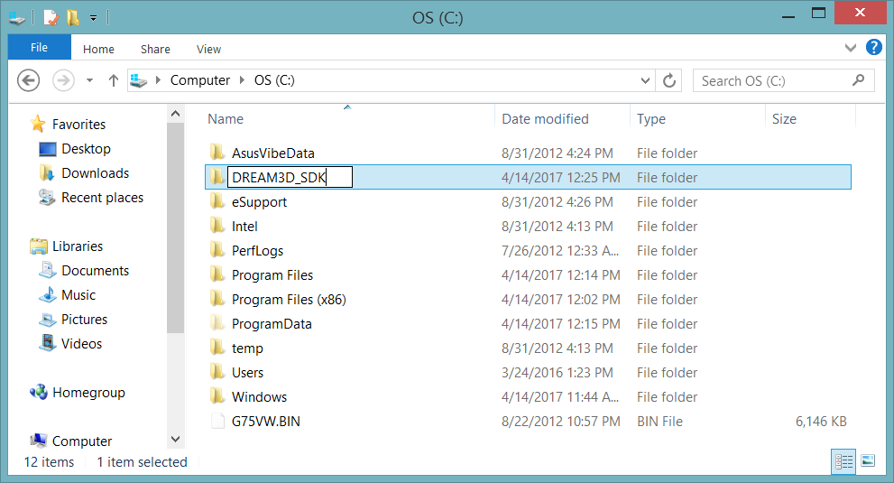

**2: Download and install CMake from https://cmake.org/download:**

Scroll down the page until you see the **Latest Release** section.  The latest release may be a higher version than 3.13.0
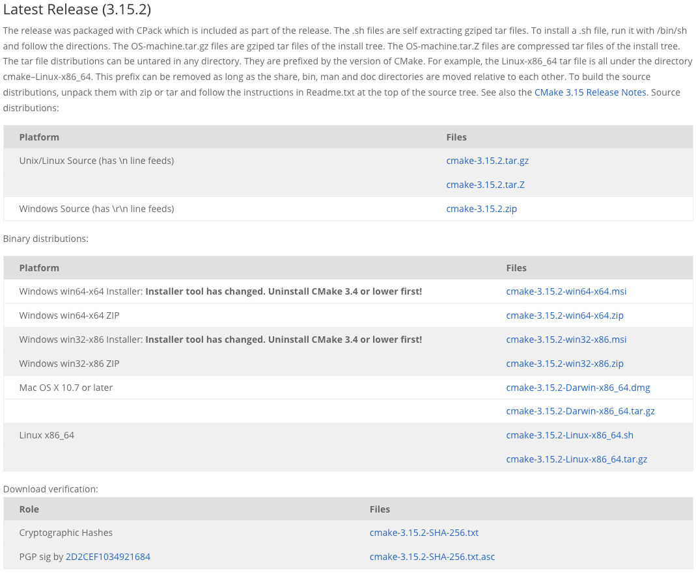
Press the download link to download the zip file of the latest release of CMake.  It does not matter if the download is for 32-bit (win32-x86) or 64-bit (win64-x64).  Again, the latest release may be a higher version than 3.13.0, but that is ok.

Click on the zip file that you just downloaded to extract it into a folder.

Move the newly extracted folder into the **DREAM3D_SDK** folder that we created earlier.
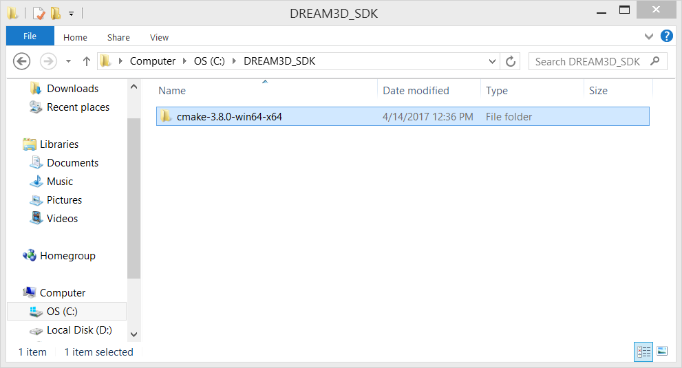

### Clone Repository ###

Create a folder called **workspace** in your home directory (C:\Users\\[username]), and then use git to clone the DREAM.3D Superbuild repository at https://github.com/bluequartzsoftware/DREAM3DSuperbuild to the **workspace** folder that you just created.  For quick access to the git terminal at a given directory, right-click on the directory and select "Git Bash Here" once git has been installed.  Then, type the following command to create a copy of the source code in the current directory:

    git clone https://github.com/bluequartzsoftware/DREAM3DSuperbuild.git

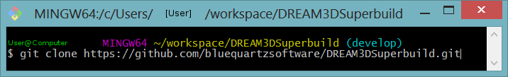

*Note*: If you use git through command prompt, the coloring in your terminal will be different, but the command to clone the repository will be the same.

### Instructions ###

1. Open CMake and set the **Where is the source code** path to *C:\Users\\[username]\Workspace\DREAM3DSuperbuild*.

2. Set the **Where to build the binaries** path to *C:\Users\\[username]\Workspace\DREAM3DSuperbuild\Build*.

3. We are going to create a CMake variable.  Press the **Add Entry** button.

4. Set the **Name** to *DREAM3D_SDK*.  Set the **Type** to *PATH* and set the **Value** to the location of the DREAM3D_SDK folder that we created earlier (*C:\DREAM3D_SDK*).
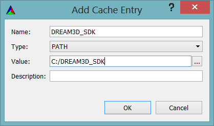

5. You should now have a single variable, DREAM3D_SDK.
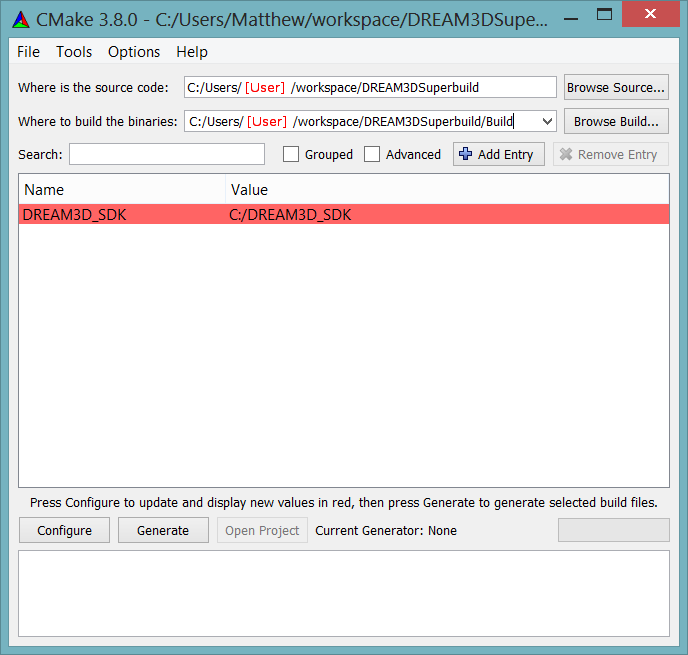

6. Press the **Configure** button in CMake.  If the build directory specified does not already exist, CMake will ask if you want to create the directory.  Click "Yes".

7. CMake will ask you which generator should be used for this project.

+ If you are using Visual Studio 2017, select Visual Studio 15 2017 Win64.
+ If you are using Visual Studio 2015, select Visual Studio 14 2015 Win64.

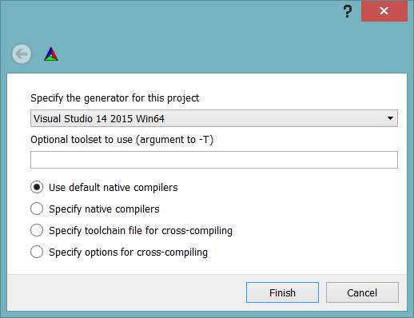

  Click **Finish**.  If the selected Visual Studio and its C++ compiler are not installed, CMake will throw an error and will not allow you to proceed until you have done so.

8. At this point, Qt 5 will be automatically downloaded and installed.  Sometimes during the installation of Qt the Qt installer application will crash.  Simply try configuring again to relaunch the Qt installer.  Since the Qt download is over 1 GB in size, this may take some time so please be patient.

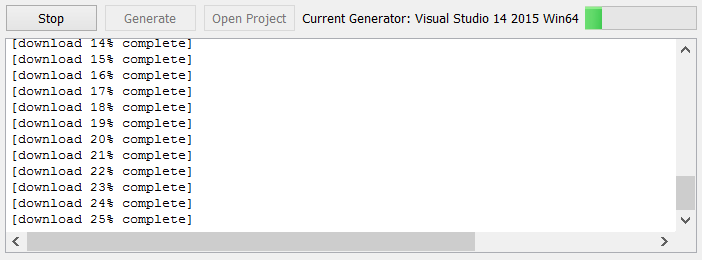

Sometimes there is a pause between the download completing and the installer popping up, so just wait a minute or so for the installer to appear.
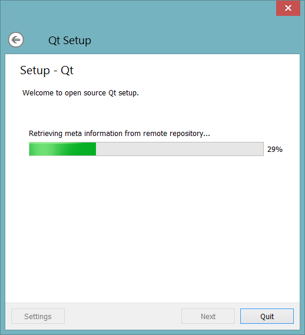

9. Press the **Configure** button in CMake again.

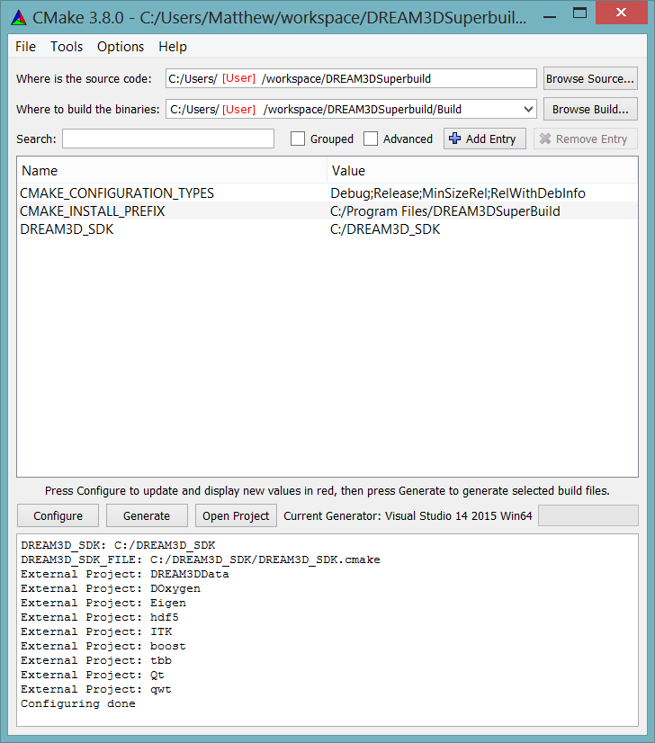

10. Press the **Generate** button in CMake to generate the build files.

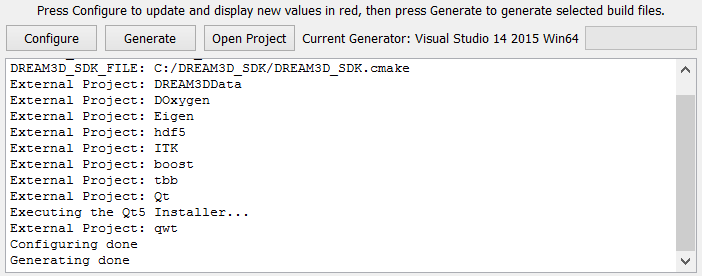

    *Note*: Although you still need to press **Configure** in step 9, Qt will not download or install again because it was already downloaded and installed the first time through.

11. Click "Open Project" to launch Visual Studio with the DREAM3DSuperBuild Project. Check that ALL_BUILD and Debug are selected.

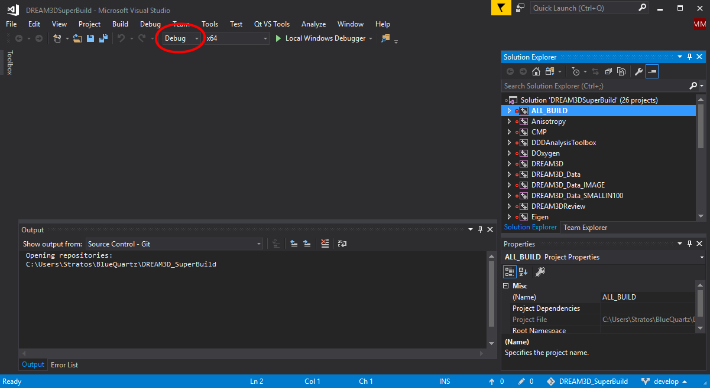

12. Click Build -> Build Solution to begin building the SDK.  This will take some time.  Please be patient as your SDK builds.

13. Change Debug selection to Release and repeat Step 12.

## Additional Notes ##

The procedure above builds the following libraries:

+ Eigen 3.3.5 or higher
+ HDF5 1.20.3.20 or higher
+ ITK 4.13.2 or higher
+ Qt 5.11.1 or higher
+ Qwt 6.1.3 or higher
+ TBB 2018_20180618 or higher

---
**Previous Page**: [Installing a Compiler Suite](http://dream3d.bluequartz.net/binaries/Help/DREAM3D/compiler_suite.html)