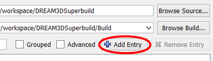

# Making an SDK (Windows) #

<a name="prerequisites">

## Prerequisites ##

</a>

These prerequisites need to be completed before making a DREAM.3D SDK.

If you have already fulfilled all of these prerequisites, skip to the [Procedure](#procedure) section.

<a name="compiler_suite">

### Install a Compiler Suite ###

</a>

A compatible compiler needs to be installed on your system to be able to build DREAM.3D.

| Product | Product Version | Compiler Version | MSVC++ Toolset |
| ------- | --------------- | ---------------- | -------------- |
| Visual Studio 2017 Pro & Community | 15.8 | 19.15 | 14.15 |
| Visual Studio 2019 Pro & Community | 16. |  |  |

This tutorial uses Visual Studio to build an SDK from DREAM3DSuperbuild.  Ensure you have the proper Version of Visual Studio installed.  Version 2017 is supported in this release and should be usable.  Both the **Professional** and **Community** versions will work.

You will also need a compatible python environment. Python version 3.8 or newer is needed as a base with the added dependency of the "mkdocs" system which is used to generate the user facing documentation for DREAM.3D. The easiest way to do this is to open a python command prompt and do

```console
    pip install mkdocs-material
```
or from an Anaconda prompt:
```console
    conda install mkdocs-material
```

DREAM.3D Developers specifically use Anaconda3 environments for development and have the most experience with those python environments. If you want to use python from another distribution it *should* be usable as long as you install "mkdocs-material" through pip. 

For more information, please visit [Installing a Compiler Suite](http://www.dream3d.io/6_Developer/CompilerSuite/index.html).

### Install Git ###

Git needs to be installed on your system to be able to clone repositories from Github.

To install Git, please visit the [Git website](https://git-scm.com/downloads).

**Note**: During the installation ensure that the "Windows command prompt" can use Git.

<a name="procedure">

## Procedure ##

</a>

### Basic Setup ###

**1: Create a folder called DREAM3D_SDK on your C:\ drive**


**2: Download and install CMake from https://cmake.org/download:**

Scroll down the page until you see the **Latest Release** section.  The latest release may be a higher version than 3.22.0


Press the download link to download the zip file of the latest release of CMake.  It does not matter if the download is for 32-bit (win32-x86) or 64-bit (win64-x64).  Again, the latest release may be a higher version than 3.22.0, but that is ok.

Click on the zip file that you just downloaded to extract it into a folder.

Move the newly extracted folder into the **DREAM3D_SDK** folder that we created earlier.


### Install Qt5 ###

[Download the official Qt5 installer](https://download.qt.io/official_releases/online_installers/qt-unified-windows-x64-online.exe) and run it. Have it install Qt5.15.x. Ignore anything about `iOS` or `Android` in the process. Take note of where the Qt installer wants to actually install Qt. It will be typically in 'C:/Qt' which is fine. You can generally place it anywhere you need/are allowed to place it.

### Clone Repository ###

Create a folder called **workspace** in your home directory (C:\Users\\[username]), and then use git to clone the DREAM.3D Superbuild repository at [https://github.com/bluequartzsoftware/DREAM3DSuperbuild](https://github.com/bluequartzsoftware/DREAM3DSuperbuild) to the **workspace** folder that you just created.  For quick access to the git terminal at a given directory, right-click on the directory and select "Git Bash Here" once git has been installed.  Then, type the following command to create a copy of the source code in the current directory:

    git clone https://github.com/bluequartzsoftware/DREAM3DSuperbuild.git


*Note*: If you use git through command prompt, the coloring in your terminal will be different, but the command to clone the repository will be the same.


### Instructions ###

1. Open CMake and set the **Where is the source code** path to *C:\Users\\[username]\Workspace\DREAM3DSuperbuild*.

  

2. Set the **Where to build the binaries** path to *C:\Users\\[username]\Workspace\DREAM3DSuperbuild\Build*.

  

3. We are going to create a CMake variable.  Press the **Add Entry** button.

    

4. Set the **Name** to *DREAM3D_SDK*.  Set the **Type** to *PATH* and set the **Value** to the location of the DREAM3D_SDK folder that we created earlier (*C:\DREAM3D_SDK*).

  

5. You should now have a few variables, DREAM3D_SDK.

  

6. Press the **Configure** button in CMake.  If the build directory specified does not already exist, CMake will ask if you want to create the directory.  Click "Yes".

7. CMake will ask you which generator should be used for this project.

+ If you are using Visual Studio 2019, select Visual Studio 16 2019.
+ If you are using Visual Studio 2017, select Visual Studio 15 2017 Win64.

8. Set the Qt Variables. Use the CMake-GUI ( or pass them in as -D variables on the command line). DO be sure to select the proper version based on the version of Visual Studio that you will be using. For this example we are using VS2019. VS2017_64 is also available.
  * Qt5_DIR: C:/DREAM3D_SDK/Qt5.15.2/5.15.2/msvc2019_64/lib/cmake/Qt5
  * QT5_QMAKE_EXECUTABLE: C:/DREAM3D_SDK/Qt5.15.2/5.15.2/msvc2019_64/bin/qmake.exe

  AGAIN: MAKE SURE YOU Set the paths correctly for YOUR installation of Qt5.

9. Press the **Configure** button in CMake again.

  

10. Press the **Generate** button in CMake to generate the build files.

  

11. Click "Open Project" to launch Visual Studio with the DREAM3DSuperBuild Project. Check that ALL_BUILD and Debug are selected.

  

12. Click Build -> Build Solution to begin building the SDK.  This will take some time.  Please be patient as your SDK builds. Once the build starts all of the dependent libaries are either built or downloaded. All libraries are installed into the DREAM3D_SDK folder that you specified earlier. Nothing that DREAM.3D depends on is installed into any system directories.

13. Change Debug selection to Release and repeat Step 12.

## Building DREAM.3D ##

Now that you have all of the dependent libraries built you are now ready to compile DREAM.3D. For the examples below we are going to assume the following folder structure:

* DREAM3D_SDK is located at C:/DREAM3D_SDK
* DREAM3D_WORKSPACE is located at C:/Users/\[USERNAME\]/Workspace

There are 6 basic git repositories that need to be cloned:

    git clone https://www.github.com/bluequartzsoftware/CMP.git
    git clone https://www.github.com/bluequartzsoftware/H5Support.git
    git clone https://www.github.com/bluequartzsoftware/EbsdLib.git
    git clone https://www.github.com/bluequartzsoftware/SIMPL.git
    git clone https://www.github.com/bluequartzsoftware/SIMPLView.git
    git clone https://www.github.com/bluequartzsoftware/DREAM3D.git

In addition there are a few extra repositories that are always built as part of the standard DREAM3D build:

    git clone https://www.github.com/bluequartzsoftware/ITKImageProcessing DREAM3D_Plugins/ITKImageProcessing
    git clone https://www.github.com/bluequartzsoftware/SimulationIO DREAM3D_Plugins/SimulationIO
    git clone https://www.github.com/dream3d/DREAM3DReview DREAM3D_Plugins/DREAM3DReview
    git clone https://www.github.com/dream3d/UCSBUtilities DREAM3D_Plugins/UCSBUtilities

After you have finished cloning the sources your *Workspace* folder should look like this:

    Workspace/CMP
    Workspace/EbsdLib
    Workspace/H5Support
    Workspace/DREAM3D
    Workspace/DREAM3D_Plugins/ITKImageProcessing
    Workspace/DREAM3D_Plugins/SimulationIO
    Workspace/DREAM3D_Plugins/DREAM3DReview
    Workspace/DREAM3D_Plugins/UCSBUtilities
    Workspace/SIMPL
    Workspace/SIMPLView

Use CMake-GUI to configure the DREAM.3D project. Before clicking the configure button it should look like the following (NOTE: Your username will be different than mine)

We are going to create a CMake variable.  Press the **Add Entry** button.

1. As before, set the **Name** to *DREAM3D_SDK*.  Set the **Type** to *PATH* and set the **Value** to the location of the DREAM3D_SDK folder that we created earlier (*C:\DREAM3D_SDK*).


Click the **Configure** button and select the proper Generator. We are using Visual Studio 15 2017 in this example. On CMake versions starting at 15.0 you now need to also select the "Platform" for the generator. In our case we want __x64__ because we are going to compile as a 64 bit application. Note that all of the selections should mirror what you selected when building the DREAM3D SDK.


Click **Finish** and let CMake configure the project for you.

When the configuration completes you should click the **Generate** button to actually generate the DREAM3DProj.sln file for Visual Studio to use. Once the generation step is complete you can use the **Open Project** button to open the project in Visual Studio. Once the project is open, in a similar fashion, go to the "Build->Build Solution" menul to build DREAM.3D. The defualt configuration is Debug.

If you are interested in building from a command line using alternate IDEs (such as QtCreator, CLion, VSCode) all of these steps are repeatable through command line invocations.
